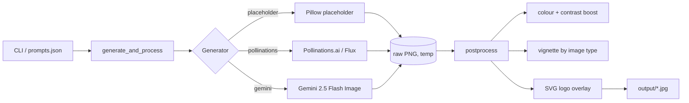

# blog-post-infografik-creator

> Generate AI-powered infographics for blog posts and apply brand post-processing (logo overlay, colour boost, vignette) — pluggable image backends, offline demo.


## What it does

Takes a prompt (or a JSON list of prompts) and produces brand-consistent infographics ready to drop into a blog post:

1. **Generate** the raw image with any of three backends — offline Pillow placeholder, free Flux via Pollinations.ai, or Google Gemini 2.5 Flash Image.
2. **Post-process** the raw image with brand colour boost (`Color` + `Contrast` enhancers), a subtle elliptical vignette for hero/photo shots, and an SVG logo overlay positioned in the top-right corner.
3. **Output** a high-quality JPG ready for upload — no manual cropping, recolouring, or watermarking needed.

The "brand" is just a JSON file pointing to a palette and a logo path, so the same pipeline works for any brand with no code changes. The `make demo` command runs end-to-end using the offline placeholder generator + a bundled "Acme" demo brand — no API key needed.

## Quickstart

```bash
git clone https://github.com/gokhanagarer/blog-post-infografik-creator.git
cd blog-post-infografik-creator
make demo
```

You'll get three branded JPGs in `output/`:

```
output/
├── open-science-hero.jpg
├── data-pipeline-info.jpg
└── analytics-photo.jpg
```

Each one has the demo Acme logo overlaid top-right, brand-coloured background, and post-processed contrast.

## Going live

```bash
cp .env.example .env
# pick a real image backend
echo "IMAGE_BACKEND=pollinations" >> .env       # free, no key
# or:
# echo "IMAGE_BACKEND=gemini" >> .env
# echo "GEMINI_API_KEY=..." >> .env

make install
.venv/bin/python -m src.main "your prompt here" output/hero.jpg --type hero
```

For batch processing, point at a JSON file:

```bash
.venv/bin/python -m src.main --batch examples/prompts.json --outdir output/
```

## Bring your own brand

Replace `assets/demo-brand/` with your own:

```
your-brand/
├── brand.json
└── logo.svg
```

Where `brand.json` looks like:

```json
{
  "name": "YourBrand",
  "colors": {
    "primary_blue":      [0, 96, 217],
    "background_grey":   [246, 246, 246],
    "highlight_orange":  [255, 175, 0]
  },
  "logo": "logo.svg"
}
```

Then pass `--brand /path/to/your-brand/brand.json` on the command line.

## Architecture



Image type modulates post-processing:

| type    | colour boost | contrast | vignette |
|---------|--------------|----------|----------|
| `hero`  | 1.30         | 1.10     | 0.20     |
| `info`  | 1.10         | 1.05     | —        |
| `photo` | 1.15         | 1.05     | 0.15     |

## Configuration

| Env var | When required | Purpose |
|---|---|---|
| `IMAGE_BACKEND` | always | `placeholder` (default) · `pollinations` · `gemini` |
| `GEMINI_API_KEY` | backend = gemini | Google AI Studio key |

## Project layout

```
.
├── src/
│   ├── brand.py        # Brand JSON loader
│   ├── generators.py   # placeholder + Pollinations + Gemini backends
│   ├── postprocess.py  # colour boost + vignette + logo overlay
│   ├── main.py         # CLI + orchestrator
│   └── demo.py         # `make demo` entrypoint
├── assets/demo-brand/  # bundled "Acme" brand for the demo
├── examples/prompts.json
├── tests/
├── Makefile
└── README.md
```

## Tests

```bash
make test
```

All tests run offline against the Pillow placeholder backend.

## License

MIT — see [LICENSE](LICENSE).
