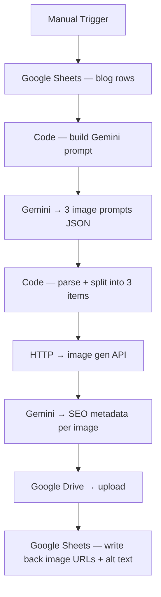

# n8n workflow — Infographic Creator

A 21-node n8n workflow that mirrors the Python pipeline. Useful if your team already runs n8n and wants the same image-gen + brand-post-processing logic inside it.

The Python script (`src/main.py`) is the canonical reference. This workflow is a teaching example showing how the same pipeline translates to nodes.

---

## What it does



Each row in the input sheet becomes 3 branded infographics (hero / info / photo), uploaded to Drive with SEO-ready filenames and alt text.

---

## How to import

1. Open n8n → **Workflows** → top-right `+` → **Import from file**
2. Pick `n8n/infographic-pipeline.json`
3. Re-bind credentials (every external node will show ⚠️)

Placeholders to replace:

| Placeholder                   | Appears in                          | What to fill in                          |
|-------------------------------|-------------------------------------|-------------------------------------------|
| `YOUR_GOOGLE_SHEET_ID`        | sheet read + write nodes            | your blog content sheet ID                |
| `YOUR_GOOGLE_DRIVE_FOLDER_ID` | drive upload nodes                  | where generated images should be stored   |
| `YOUR_GEMINI_API_KEY`         | inline in `Build Request` JS code   | https://aistudio.google.com/app/apikey    |
| `YOUR_CREDENTIAL_ID`          | all Google credential refs          | re-select from dropdown                   |

> The original workflow had a hardcoded Gemini key in the `Build Request` code node. That key was scrubbed; if you copy/paste this workflow into your own n8n, **do not paste a real key inline** — use an n8n credential and reference it from the HTTP Request node instead.

---

## Set up the Google Sheet

Create a sheet with these columns:

| Blog ID | Blog Title | Summary/Content | Status | Hero URL | Info URL | Photo URL | Hero Alt | Info Alt | Photo Alt |
|---------|------------|------------------|--------|----------|----------|-----------|----------|----------|-----------|
| 001     | …          | …                | pending| (filled) | (filled) | (filled)  | (filled) | (filled) | (filled)  |

The workflow reads rows where `Status == pending`, generates 3 images per row, uploads them to Drive, and writes the URLs + AI-generated alt text back.

---

## Credentials to connect

| Node type        | Credential                | Where to get it                                              |
|------------------|---------------------------|---------------------------------------------------------------|
| `googleGemini`   | Google AI Studio API key  | https://aistudio.google.com/app/apikey                       |
| `googleSheets`   | Google OAuth2 (Sheets)    | https://console.cloud.google.com → enable Sheets API         |
| `googleDrive`    | Google OAuth2 (Drive)     | Same Cloud project, add Drive scope to the OAuth client      |
| `httpRequest`    | (none for Pollinations)   | n8n calls `image.pollinations.ai` without auth               |

---

## Notable nodes

1. **`Build Request`** — pure JS in a Code node; constructs a Gemini prompt asking for 3 image prompts as JSON, plus SEO metadata (filename, alt text, description) for each. The output is normalised into a `requestBody` object passed to the next HTTP node.
2. **`If — JSON parse OK`** — checks the LLM returned valid JSON; failures route to a branch that flags the row instead of crashing the run.
3. **`Merge — hero/info/photo`** — joins the 3 image-gen calls back into a single payload so the sheet write happens once per blog row.
4. **`Code — build SEO prompt`** — wraps a second Gemini call per image asking only for SEO metadata; cheaper than a single mega-prompt and produces better filenames.

---

## Run it

- **Test mode**: click `Manual Trigger` → **Execute Workflow**; watch one row turn from `pending` to `done` in the sheet
- **Schedule**: swap `Manual Trigger` for `Schedule Trigger`; activate the workflow
- **Per-row error handling**: rows that error don't block the rest of the batch; their `Status` becomes `error` with the message in a `Notes` cell

---

## Brand customisation

Open the `Build Request` Code node. You'll find a section with the brand-color hex codes used in image prompts:

```js
- PRIMARY: #0060D9 (deep blue — dominant)
- ACCENT:  #FFAF3B (warm amber — highlights)
- SECONDARY: #9ACA3C (green — success/growth)
- LIGHT: #6DCFF6 (cyan — tech glows)
```

Replace these with your own brand palette. The LLM uses them to keep image generation consistent across runs without needing reference images.

> **Tip**: the Python version's `brand.json` does the same thing more cleanly — if you're maintaining both pipelines, edit the JSON and have a small script paste those values into the n8n Code node, so brand changes propagate to both.

---

## Cost notes

- **Gemini free tier** — 15 req/min, 1500 req/day. Each blog row uses ~4 Gemini calls + 3 image generations = 7 req. So free tier covers ~200 blog posts/day.
- **Pollinations.ai** — free, unmetered, but rate-limited (~1 img/5 s)
- **Google Sheets / Drive** — free for personal Google accounts

Daily run of 5 blog rows = 35 Gemini req + 15 image gens, well under any free quota.

---

## When to use the n8n version vs Python

| Choose **n8n** when                                       | Choose the Python script when                                |
|-----------------------------------------------------------|---------------------------------------------------------------|
| You operate n8n already and want everything visualised    | You don't run n8n and don't want to                          |
| Non-developers will tweak brand colors or prompts          | The pipeline lives inside another codebase                    |
| You want execution logs / retries out of the box           | Cost matters — Python on cron is free, n8n cloud is metered  |
| You want to wire it into other n8n flows (CMS, CRM, Slack) | You'd rather write tests in pytest than click around          |
